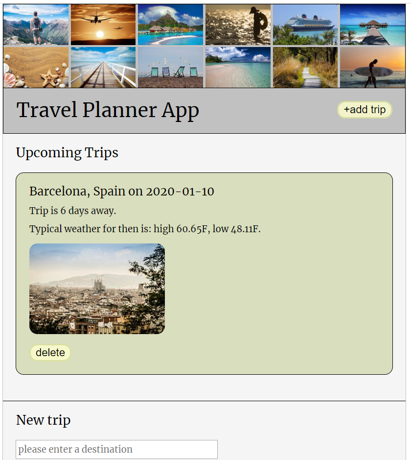

# Travel App

## Project Objective

The objective is to build a website that allows the user to add future trips.

The user can enter a destination of interest and save his trip. A countdown and a weather forecast are displayed. The user can delete any trip.

## Comments
### Architecture
Added additional folder test/server, since testing server routes doesn't work with jest.

### Webpack

## Result
<figure>
<figcaption>GUI when no trip has been planned yet.</figcaption>

</figure>
 

<figure>
<figcaption>GUI when user has searched for a city.</figcaption>

</figure>
 

<figure>
<figcaption>GUI when user added a city to his trip list.</figcaption>

</figure>

