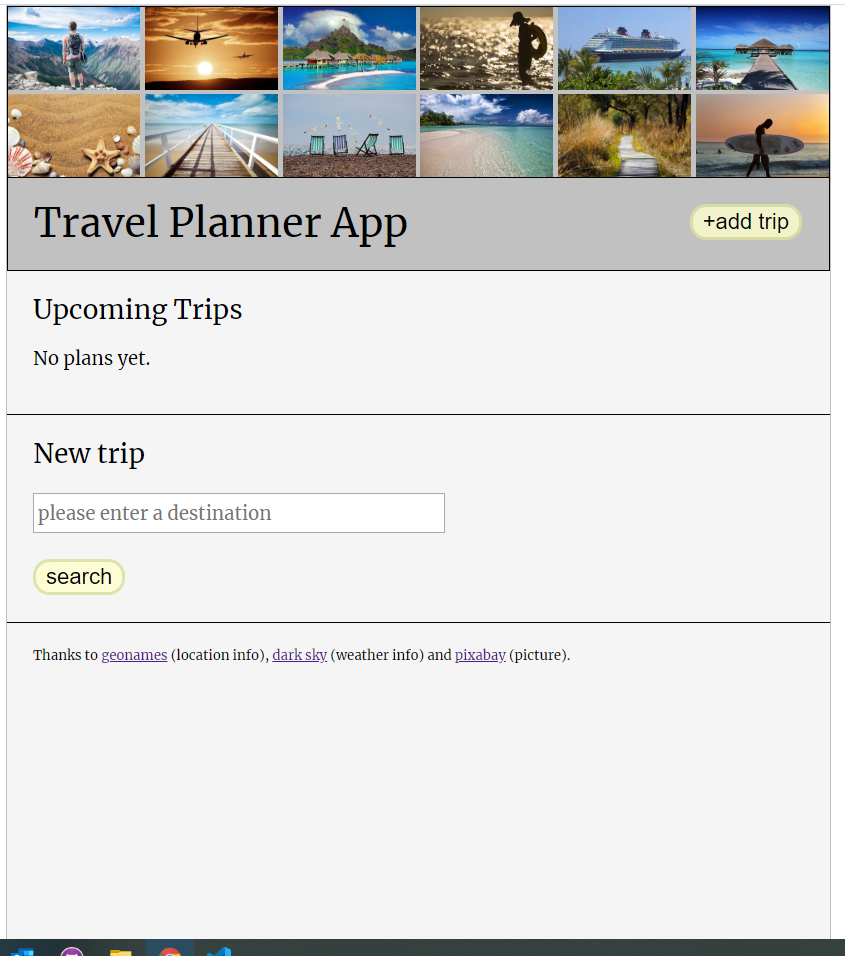
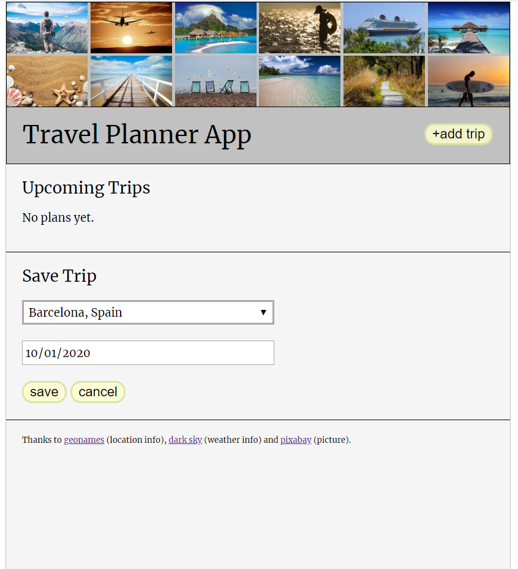

# Travel App

## Project Objective

The objective is to build a website that allows the user to add future trips.

The user can enter a destination of interest and save his trip. A countdown and a weather forecast are displayed. The user can delete any trip.

## Comments

### Architecture

Added additional folder test/server, since testing server routes doesn't work with jest.

### Webpack

The scripts 'start', 'build-prod' and 'build-dev' are as described in class.

Test scripts see description next paragraph.

The script 'startAll' is for development. It rebuilds the dist folder, and restarts the express server after file changes.

### Testing

The script 'test' is for testing the client side (with fetch-mock-jest) .

The scripts 'supertest_server' and 'supertest_unittest' is for testing routes on the server side.

### Offline capabilities

Implemented as in class.

## HTML & CSS

### Visual Design

-when user click '+ add trip' button, the window scrolls down to the search field for places.
-sticky header

## API and JS Integration

### Extend Options

User can delete a trip.

## Documentation

### Code Quality

Code is reviewed by ESLint.

## Result

<figure>
<figcaption>GUI when no trip has been planned yet.</figcaption>

</figure>
 

<figure>
<figcaption>GUI when user has searched for a city.</figcaption>

</figure>
 

<figure>
<figcaption>GUI when user added a city to his trip list.</figcaption>

</figure>
